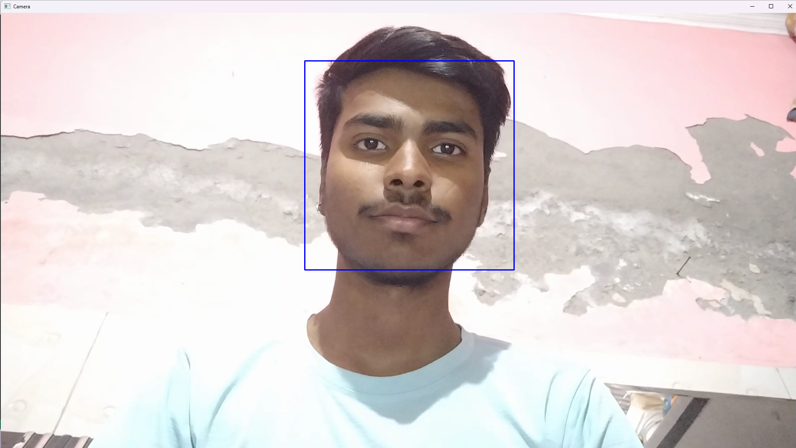

# Face Detection Project

This project captures video from the default webcam, detects faces in each frame, and draws rectangles around the detected faces using OpenCV.

## Description

The Face Detection project utilizes computer vision techniques to detect human faces in real-time video streams captured from a webcam. By leveraging the OpenCV library, the project detects faces within each frame of the video feed and draws bounding boxes around the detected faces. This provides a visual representation of where faces are located within the video stream.

The heart of the project lies in the utilization of a pre-trained cascade classifier, specifically the `haarcascade_frontalface_default.xml` file, which contains patterns of features that are characteristic of human faces. This classifier is used to identify potential face regions within each frame of the video feed.

The project is implemented in Python and is encapsulated within a Jupyter Notebook (`Face_Detection.ipynb`), making it easy to understand and modify. Additionally, the project includes clear instructions for installation, usage, and any necessary dependencies, ensuring that users can easily replicate and run the face detection system on their own machines.

Overall, the Face Detection project serves as an educational and practical example of how computer vision techniques can be applied to detect and localize human faces within a video stream, with potential applications ranging from security and surveillance to augmented reality and human-computer interaction.


## Files

1. `Face_Detection.ipynb`: Jupyter Notebook containing the Python script for face detection.
2. `haarcascade_frontalface_default.xml`: XML file containing the pre-trained cascade classifier for face detection.

## Installation

1. **Clone the Repository**: Clone this repository to your local machine using the following command:
   ```
   git clone https://github.com/KrishanMohanDev/Face-Detection.git
   ```

2. **Install Dependencies**: Install the required dependencies using pip:
   ```
   pip install opencv-python
   ```

## Usage

1. **Run the Script**: Open the `Face_Detection.ipynb` notebook and execute the cells to run the face detection script.
   ```
   jupyter notebook Face_Detection.ipynb
   ```

2. **Exit the Script**: Press the 'a' key to exit the script.

## Example Screenshot



## Notes

- Make sure to have the `haarcascade_frontalface_default.xml` file in the same directory as the `Face_Detection.ipynb` notebook.

## Author

- [Krishan Mohan Mandal](https://github.com/KrishanMohanDev)
